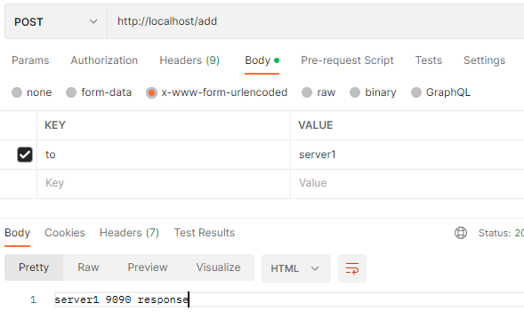
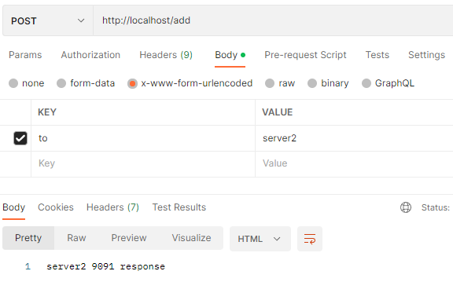

# 动态路由demo

根据post请求的参数，动态的路由到指定的机器

## Server1
```bash
npm install
node index.js
```

## Server2
```
npm install
node index.js
```

## OpenResty
```
start nginx.exe
OR
双击nginx.exe
```
## 预览
匹配请求体的内容，分发到不同的服务器



